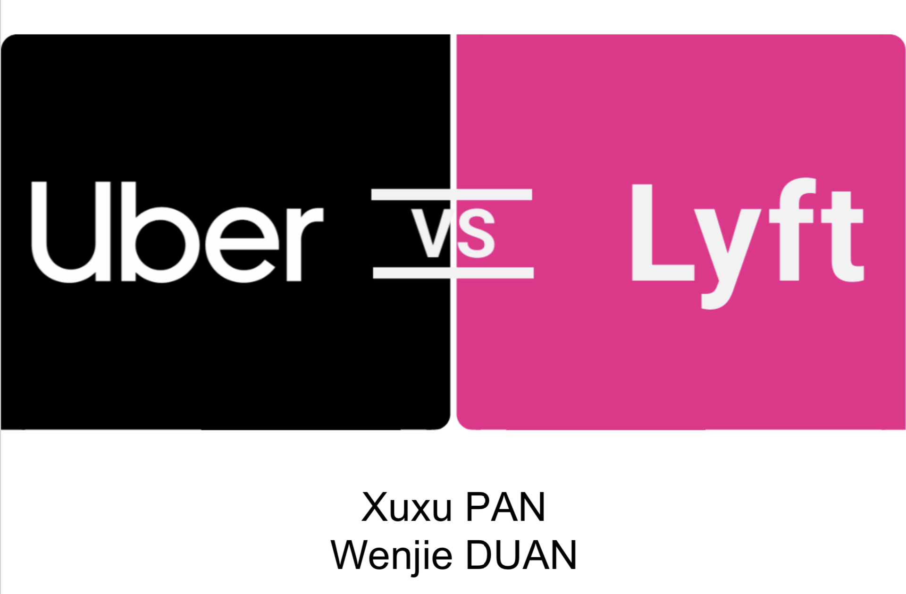
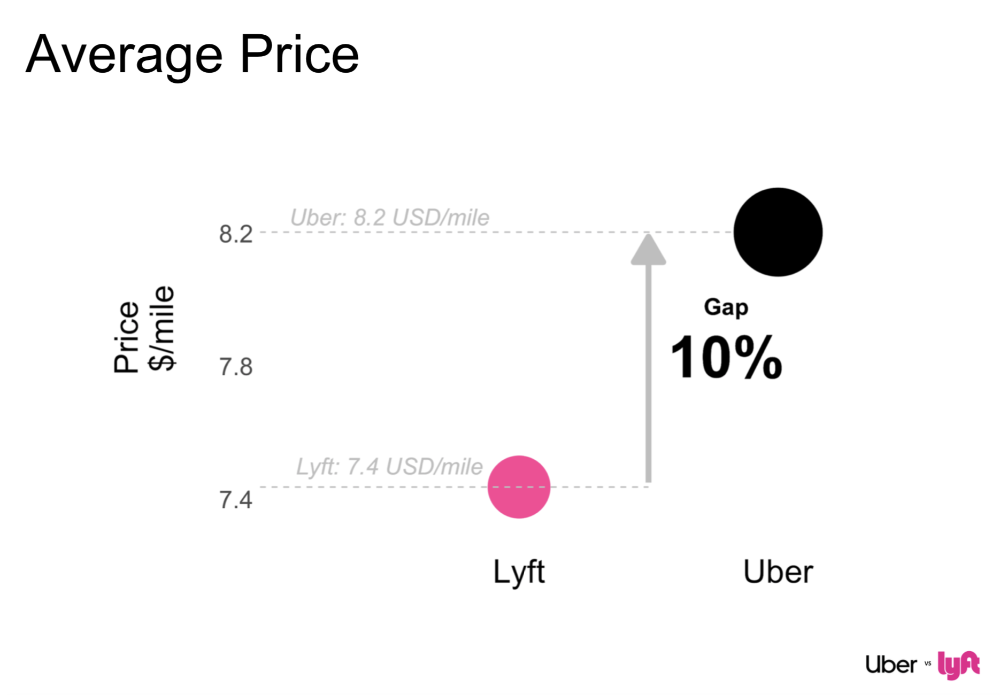
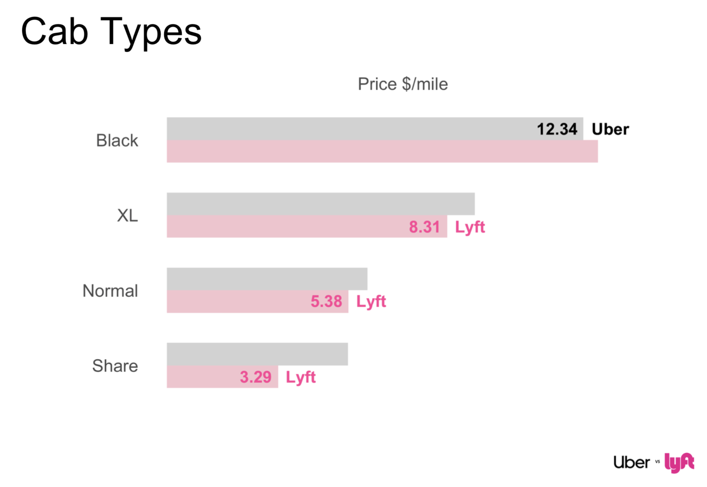
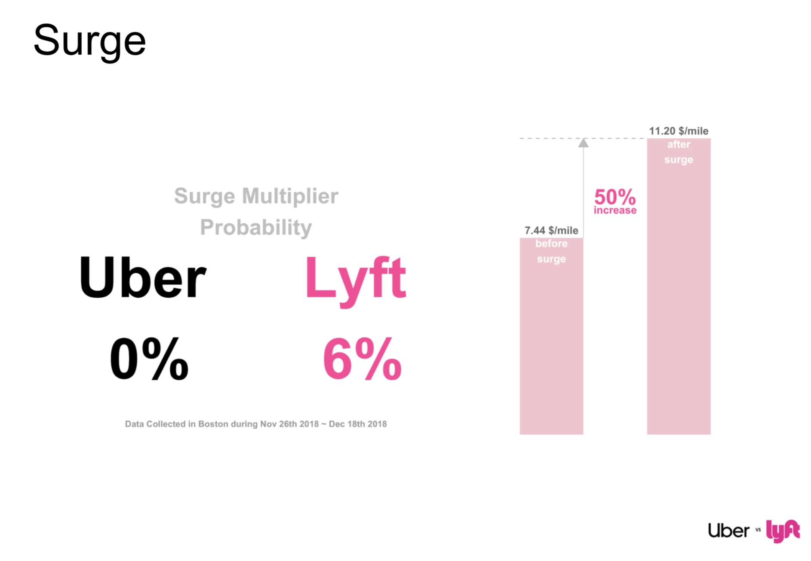
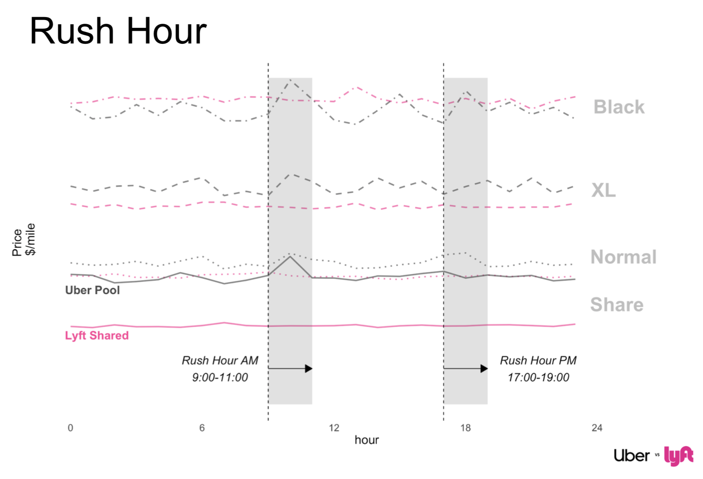
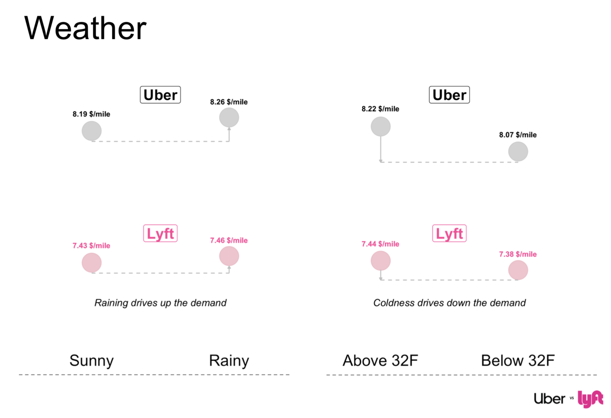

# Uber vs Lyft Pricing
Group Member: Xuxu Pan, Wenjie Duan

#### Dataset:

##### Cab Data

-  Realtime data queried every 5 mins of Uber and Lyft
-  From Nov 26th to Dec 18th 2018, in Boston
-  Observations: 693,071
-  Variables: price, distance, cab_type, surge_multiplier, name, time

##### Weather Data
- Joined with cab data on time and location
- Weather information collected every 1hr
- Observations: 6276
- Variables: temp, rain

Source: https://www.kaggle.com/ravi72munde/uber-lyft-cab-prices

- The average price of Uber is 10% higher than Lyft!

- Compare four different types of cabs:
  - The Share Cab: Lyft shared and Uber Pool;
  - The Normal one: Lyft and UberX;
  - The Extra Large one: XLs;
  - The Black Luxury one: Lyft Lux Black and Uber Black.
- In most cases, Lyft is less expensive and should be your choice. 

- Lyft is more sensitive to Surge Multiplier
  - In our dataset for three weeks in Boston, the Surge Multiplier was not triggered a single time in Uber. However, in Lyft, 6% of the time you will get a surge multiplier. 

- There are indeed rush hours in the morning and evening, which are roughly 9:00-10:00 AM and 5:00-7:00 PM.
- Lyft Shared is really cheap! 
  - It’s much cheaper than its competitor Uber Pool, and it’s not affected by the rush hour.
- Uber Pool is really not a good choice. It is almost the same price with normal Lyft for all times in a day and even more expensive in morning rush hours.
  - Why should we grab a shared cab if the price is almost the same with taking a cab on our own?

- The cab price in Rainy days is higher than Sunny day.
- The temperature also influenced the price, however, in an interestingly opposite way. 

#### Conclusion
- If you need a luxury cab, for big days or for important people, go for Uber. Otherwise, Lyft is your choice.
- When you see a surge multiplier in Lyft, it may be good to check Uber.
- In rush hours, Lyft Shared in your friend. Uber Pool is never your friend at any time.
- If you have to go out in a cold day, one good thing is that you can indulge yourself with a cab ride because it’s cheaper than in warm days.

